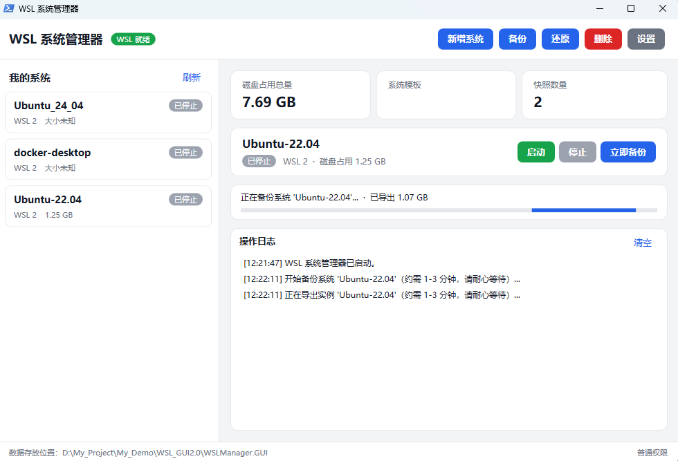
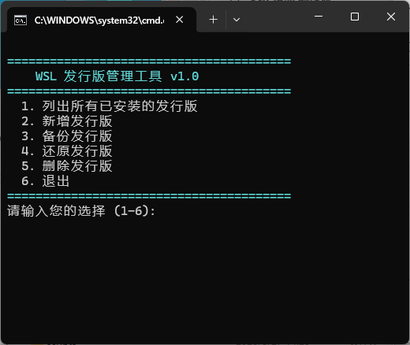

<p align="center">
  <h1 align="center">WSLManager</h1>
  <p align="center">
    一款零安装、全便携的 WSL 发行版管理工具 —— 通过图形界面或交互式菜单即可完成创建、备份、恢复和删除。
  </p>
</p>

<p align="center">
  
  
  
  <br>
  
  
  
</p>

---

## 目录

- [项目简介](#项目简介)
- [界面预览](#界面预览)
- [功能特性](#功能特性)
- [快速开始](#快速开始)
- [GUI 使用指南](#gui-使用指南)
- [TUI 使用指南](#tui-使用指南)
- [目录结构](#目录结构)
- [配置说明](#配置说明)
- [安全与隐私](#安全与隐私)
- [常见问题](#常见问题)
- [项目链接](#项目链接)

---

## 项目简介

**WSLManager** 是一款面向 Windows 用户的**零安装、全便携** WSL（Windows Subsystem for Linux）发行版管理工具。无需 `winget`、无需 `apt`、无需注册表改动，所有数据（母版、实例、备份）全部保存在工具所在目录下，复制文件夹即可带走全部环境。

**适用场景：**

- 需要同一发行版的多个实例（不同配置、不同项目隔离）
- 希望定期备份 WSL 数据，防止系统更新导致环境丢失
- 追求便携 —— 工具可放在 U 盘或任意目录，随时带走
- 重视安全 —— 工具承诺不与外部通信，不写注册表，不创建服务或计划任务

> **版本说明**：v0.2 起同时提供 **GUI（图形界面）** 与 **TUI（命令行菜单）** 两种交互模式。GUI 为推荐方式，操作更直观；TUI 适合轻量场景或远程服务器使用。

---

## 界面预览

### GUI 图形界面（推荐）

双击 `WSLManager.GUI.bat` 即可启动 WPF 图形界面。主界面采用三栏布局：左侧为系统列表，右侧上方展示数据概览，右侧下方为系统详情与操作日志。支持浅色 / 深色主题自适应。

<p align="center">
  
</p>

### TUI 命令行菜单

双击 `WSLManager.bat` 启动命令行交互菜单，适合不依赖图形环境的场景。

<p align="center">
  
</p>

---

## 功能特性

| 功能 | 说明 |
|:---|:---|
| **列出实例** | 展示所有已安装的 WSL 发行版及其版本、状态、大小 |
| **新增发行版** | 三种来源：微软商店在线安装 / 本地母版仓库 / 自定义 `.tar` 文件 |
| **备份发行版** | 将实例导出为 `.tar`，自动检测磁盘空间并按保留数清理旧备份 |
| **还原发行版** | 从备份恢复，支持覆盖原实例或创建新实例 |
| **删除发行版** | 四级清理粒度（仅注销 / 删备份 / 删母版 / 全量清理），删除前需输入完整实例名二次确认 |
| **启动 / 停止** | 一键启动 WSL 实例（打开终端）或安全停止运行中的系统 |
| **完全便携** | 无需安装，复制整个文件夹即可在任何 Windows 10/11 机器上运行 |
| **可配置** | `Data/Config/config.json` 控制 WSL 版本、备份保留数、数据存放路径 |
| **零额外依赖** | 仅需系统自带的 PowerShell 5.1 + WPF，无需 Node.js / Python / 第三方库 |

---

## 快速开始

### 前置要求

- Windows 10（版本 2004+）或 Windows 11
- WSL 已启用（运行 `wsl --version` 确认）
- 无需手动准备管理员权限（GUI 按需提权；TUI 启动时自动请求 UAC）

### 使用方法

```
1. 下载 Release 中的 zip 包并解压到任意位置
2. 双击 WSLManager.GUI.bat 启动图形界面（推荐）
   或双击 WSLManager.bat 启动命令行菜单
3. 按界面提示操作即可
```

首次启动时，工具会自动创建统一数据目录 `Data/`（含 `Config/`、`Repositories/`、`Instances/`、`Backups/`）并生成默认配置文件。

---

## GUI 使用指南

### 启动方式

| 方式 | 操作 |
|:---|:---|
| **双击启动（推荐）** | 直接双击 `WSLManager.GUI.bat` |
| **命令行启动** | `powershell -NoProfile -ExecutionPolicy Bypass -File ".\scripts\WSLManager.GUI.ps1"` |
| **调试启动（显示控制台）** | 将 `.bat` 中的 `-WindowStyle Hidden` 去掉后启动 |

### 主界面布局

- **左侧「我的系统」**：列出所有已安装的 Linux 系统，绿色徽章 = 运行中，灰色 = 已停止
- **右上概览卡片**：磁盘占用总量、系统模板数量、快照数量
- **右下详情面板**：系统详情、启动/停止/立即备份按钮
- **底部状态栏**：数据存放位置和当前权限状态
- **操作日志**：右下角实时显示每步动作与结果（成功 = 绿色、警告 = 橙色、失败 = 红色）

列表每 5 秒自动刷新，也可手动点击刷新。

### 创建新系统

点击右上角 **「新增系统」**，按三步向导操作：

1. **选择来源**：
   - **微软商店在线安装**：从官方网络源直连下载（需联网，约 5–20 分钟）
   - **本地系统模板**：用已有的模板快速复制一个新系统（最快）
   - **自定义 `.tar` 文件**：从已有的 tar 存档导入
2. **选择具体项**：选发行版 / 选模板 / 选 tar 文件
3. **命名**：输入系统名称（自动给出默认名），选 WSL 版本（默认 WSL 2）

> 名称重复时会提示更换。导入过程会弹出一次管理员授权，属正常现象。

### 启动 / 停止系统

1. 在左侧列表**点击选中**一个系统
2. 右侧详情面板点 **「启动」**（会打开一个终端窗口）或 **「停止」**

### 备份系统（快照）

1. 选中一个系统
2. 点 **「立即备份」**（或顶部「备份」）
3. 等待 1–3 分钟，日志面板会显示进度
4. 成功后日志会显示备份文件路径和大小

> 每个系统默认最多保留 5 个快照，超出会自动清理最旧的（可在设置中调整）。磁盘空间不足 5GB 时会先警告。

### 还原系统（从快照恢复）

1. 点顶部 **「还原」**
2. 从快照时间线选择一个快照（按时间倒序）
3. 选择还原方式：
   - **覆盖原系统**：替换该系统全部数据（有红色警告）
   - **创建新系统**：从快照复制出一个新系统（更安全）
4. 点「开始还原」等待完成

### 删除系统

1. 选中一个系统，点顶部 **「删除」**（红色按钮）
2. 选择清理级别：

| 级别 | 删除内容 |
|:---|:---|
| 1 | 仅移除系统记录（保留快照和模板） |
| 2 | 移除记录 + 删除快照 |
| 3 | 移除记录 + 删除快照 + 删除模板 |
| 4 | 全量清理（删除所有相关文件） |

3. **输入系统完整名称**二次确认（防误删，不可跳过）
4. 点「确认删除」，会弹出一次管理员授权

> 任一步失败会立即中止，避免产生"半删不删"的残留。

### 设置

点右上角 **「设置」**，可修改：

| 设置项 | 说明 | 默认 |
|:---|:---|:---|
| 数据存放位置 | 留空 = 工具目录；可迁移到非系统盘（如 `D:\WSLData`） | 空 |
| 默认 WSL 版本 | 新建系统的默认版本 | 2 |
| 快照保留数量 | 每系统最多保留的快照数（0 = 不清理） | 5 |

保存后立即生效，并写回 `Data/Config/config.json`。

---

## TUI 使用指南

TUI（命令行菜单）是早期的交互方式，现作为附属选项保留，适合无图形环境或偏好终端操作的用户。

### 启动

双击 `WSLManager.bat`，工具会自动检测权限并在需要时请求 UAC 提权，随后显示交互式菜单：

```
========================================
       WSLManager - 发行版管理工具
========================================
  1. 列出已安装的 WSL 发行版
  2. 新增发行版
  3. 备份发行版
  4. 还原发行版
  5. 删除发行版
  6. 设置
  0. 退出
========================================
```

输入对应数字即可执行功能，操作逻辑与 GUI 保持一致。

---

## 目录结构

```
WSLManager/
├── WSLManager.bat          ← TUI 启动器
├── WSLManager.GUI.bat      ← GUI 启动器
├── scripts/                ← 核心模块
│   ├── WSLManager.psm1     ← TUI 核心引擎
│   ├── WSLManager.Engine.psm1  ← GUI/TUI 共用引擎层
│   └── WSLManager.GUI.ps1  ← WPF 图形界面主程序
├── docs/
│   └── assets/             ← 界面截图与文档资源
├── README.md               ← 本文档
├── LICENSE                 ← MIT 许可证
└── Data/                   ← 统一数据目录（首次运行自动重建）
    ├── Config/             ← 用户配置
    │   └── config.json
    ├── Repositories/       ← 母版仓库（每个发行版一个 base.tar）
    ├── Instances/          ← WSL 实例虚拟磁盘（.vhdx）
    └── Backups/            ← 发行版备份（.tar）
```

> **注意**：若 `Data/Instances/` 下存在已注册的实例，直接移动文件夹会导致实例注册路径失效而无法启动。移动前请先使用"备份发行版"功能导出 `.tar`，移动后通过"还原发行版"重建实例。

---

## 配置说明

编辑 `Data/Config/config.json`（首次启动或不存在会自动生成）：

| 配置项 | 说明 | 默认值 |
|:---|:---|:---|
| `WSLRoot` | 所有 WSL 数据的根目录；留空则使用工具目录下的 `Data` 文件夹。三大数据（母版/实例/备份）会随它迁移，`config.json` 仍固定在 `Data\Config\` | `""`（工具目录下的 `Data`） |
| `DefaultWSLVersion` | 新建实例时默认的 WSL 版本（1 或 2） | `2` |
| `BackupRetentionCount` | 每个实例保留的最大备份数，超出则删除最旧的（0 = 不自动清理） | `5` |

> **提示**：将 `WSLRoot` 配置为其他盘符路径（如 `D:\WSLData`），可将大体积数据（母版、实例、备份）迁移到非系统盘，节省 C 盘空间。工具会在该路径下自动创建所有数据子目录（`config.json` 仍保存在工具目录的 `Data\Config\`）。

---

## 安全与隐私

本工具在设计上做出了以下承诺，并在代码中逐一落实：

| 承诺 | 实现方式 |
|:---|:---|
| **无网络访问** | 不发起任何 HTTP/HTTPS 请求；仅调用本地 `wsl.exe` |
| **无注册表写入** | 不调用 `reg add` / `Set-ItemProperty` 等注册表操作 |
| **无服务 / 计划任务** | 不创建 Windows Service 或 Scheduled Task |
| **文件操作范围受限** | 所有文件读写均限制在 `WSLRoot` 指向的目录树内 |
| **管理员权限可控** | GUI 按需提权（仅写操作时弹一次 UAC），TUI 启动时检测权限，不足则自动请求提权 |
| **删除二次确认** | 删除实例前要求输入完整实例名，防止误操作 |

> **说明**：注销、删除 WSL 发行版需要管理员权限，这是 WSL 的系统要求，并非工具额外越权 —— 直接使用 `wsl --unregister` 等命令同样需要管理员权限。

---

## 常见问题

**Q：启动时提示"需要管理员权限"**

A：这是正常行为。TUI 工具会自动弹出 UAC 提权窗口，点击"是"即可。若多次弹出，请检查 `.bat` 文件是否被安全软件拦截。GUI 仅在执行写操作（新增/还原/删除）时弹一次 UAC，浏览和备份无需提权。

**Q：能否在非管理员账户下使用？**

A：部分 WSL 操作（如 `wsl --unregister`、`wsl --import`）需要管理员权限。工具会在需要时请求提权。若系统策略禁止 UAC，请改用管理员账户运行。

**Q：删除实例后 `Instances/` 下仍有目录**

A：删除级别 1–3 不会删除实例目录（仅注销 WSL 记录或删除备份 / 母版）。选择级别 4（全量清理）才会一并删除 `Instances/` 下的目录。

**Q：`wsl -l -q` 列出的实例名称乱码**

A：已知 PowerShell 5.1 下 `wsl -l -q` 返回 UTF-16 LE 编码并含 NUL 字节。工具已内置处理逻辑，正常情况下不会乱码。若仍有问题，请在终端执行 `chcp 65001` 切换到 UTF-8 代码页。

**Q：备份时提示"磁盘空间不足"**

A：工具会在备份前检查目标驱动器剩余空间，不足 5GB 时会提示并询问是否继续。建议确保目标盘有至少与源实例同等大小的空闲空间。

**Q：支持哪些 WSL 版本？**

A：同时支持 WSL 1 和 WSL 2，默认创建 WSL 2 实例；可在 `config.json` 中修改 `DefaultWSLVersion`。

**Q：GUI 和 TUI 可以混用吗？**

A：可以。两者共用同一套 `Data/` 目录和 `config.json`，在 GUI 中创建的实例可以在 TUI 中管理，反之亦然。

---

## 项目链接

- **源代码**：[github.com/LSJ9651/WSLManager](https://github.com/LSJ9651/WSLManager)
- **Release 下载（zip 包）**：[GitHub Releases](https://github.com/LSJ9651/WSLManager/releases)
- **问题反馈与建议**：[Issues](https://github.com/LSJ9651/WSLManager/issues)

---
